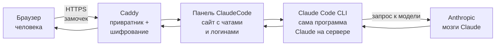
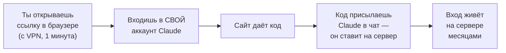

# Как это устроено простыми словами

Ты ничего не набираешь в терминале — пишешь Claude в чат, он делает сам.

Эта страница — без команд и без установки. Просто объясняет, что за штуку ты
поднимаешь, из чего она собрана и почему работает. Прочитал — и дальше все
остальные инструкции читаются легче.

## Зачем это вообще нужно

Сайт `claude.ai` в России часто не открывается. Обычный выход — VPN на каждом
компьютере: у кого-то он тормозит, у кого-то отвалился, кому-то лень.

Мы делаем по-другому. Ставим **один сервер в Европе** (Нидерланды, Германия,
Польша) — там Claude открывается свободно. На этом сервере крутится Claude. А
команда заходит не на `claude.ai`, а на **твой собственный адрес** — обычный сайт
по HTTPS (защищённое соединение, замочек в браузере), например
`https://203-0-113-45.sslip.io`.

Ключевая мысль: **блокировать нечего.** Для интернет-провайдера это просто ещё
один сайт. В Claude ходит европейский сервер, а не компьютер человека. Поэтому
команде VPN не нужен — заходят из браузера как на любой другой сайт.

> VPN понадобится ровно **один раз на 1 минуту** — тебе лично, когда будешь
> впервые входить в свой Claude на сервере (см. ниже «вход по подписке»). Команде
> — никогда.

## Из чего это собрано

Когда человек пишет сообщение в панели, оно проходит по цепочке:



Что делает каждый кусок, по-человечески:

| Кусок | Что это | Простыми словами |
|---|---|---|
| **Браузер** | сайт открывается в Chrome/Safari | то, что видит человек: чаты, папки, кнопки |
| **Caddy** | привратник у входа | делает HTTPS (замочек), сам бесплатно получает сертификат, пропускает внутрь |
| **Панель ClaudeCode** | сам сайт | логины, чаты, папки, кнопки. Надпись сверху — «ClaudeCode» (можно поменять) |
| **Claude Code CLI** | программа Claude на сервере | на каждое сообщение запускается, читает файлы, отвечает |
| **Anthropic** | серверы Claude | собственно «мозги», которые пишут ответ |

Панель — это не наша самоделка с нуля, а готовый открытый проект (Claude Code UI
от siteboon) с нашими доработками поверх: русский вид, тёплая тема Claude,
изоляция людей друг от друга, вход/выход, вложения любого типа.

## Как ты этим управляешь

Сразу пойми главное: **ты не заходишь на сервер и ничего не набираешь в
терминале.** Ты открываешь этот комплект как проект в Claude Code (или Codex) и
просто пишешь в чат человеческими словами, что нужно. Claude сам подключается к
серверу и всё делает — ставит, чинит, заводит людей, делает бэкапы.

Примеры фраз, которые ты пишешь **в чат**:

- «Заведи пользователя, логин anna_ivanova, имя Анна Иванова» — Claude сам
  придумает надёжный пароль, заведёт человека на сервере и пришлёт тебе логин и
  пароль, чтобы отдать человеку.
- «Панель не открывается, посмотри что с ней» — Claude проверит службы и починит.
- «Проверь, жив ли вход в Claude» — Claude дёрнет сервер и скажет.
- «Сделай бэкап» / «Обнови панель» / «Перенеси всё на новый сервер» — Claude
  сделает.

Твои руки нужны только в двух местах, где Claude физически не может: **клики в
веб-панели [Timeweb](https://timeweb.cloud/?i=144973)** при создании сервера и **вход в
браузере** (открыть ссылку с VPN и прислать код обратно в чат). Всё остальное делает
Claude — ты только пишешь. Ссылка на Timeweb моя, реферальная: цена для тебя обычная, а
мне за регистрацию по ней начислят небольшой бонус — буду благодарен, если поддержишь.

## Главная идея: одна подписка на всех, но каждый в своём загоне

Это самое важное, что стоит понять.

**Подписка Claude — одна.** Ты один раз входишь в свой аккаунт Claude на сервере,
и этой подпиской пользуется вся команда. Отдельная подписка на каждого не нужна.

**Но люди не видят друг друга.** У каждого свой логин и пароль, свои чаты, своя
папка. Человек заперт (по-английски это называется «песочница» или jail — загон) в
папке `/srv/cloudcli-users/его-логин` и не может выйти за её пределы через панель.
При первом входе ему сразу готова папка-проект — ничего вводить не надо, открыл и
работаешь.

```
Одна подписка Claude
        │
        ├── Анна   →  своя папка, свои чаты   (чужого не видит)
        ├── Борис  →  своя папка, свои чаты   (чужого не видит)
        └── Вера   →  своя папка, свои чаты   (чужого не видит)
```

Разграничение держится на двух вещах сразу. Первая — сам сайт: панель не выпускает
человека за пределы его папки. Вторая — права на диске: папка каждого закрыта на
`0700`, читать её может только владелец. Поэтому другая программа на сервере (бот,
второй сервис, новая учётка) чужие файлы не откроет, а из общей папки
`/srv/cloudcli-users` со стороны даже не виден список логинов.

Честно про предел: панель и сам Claude на сервере работают от главного пользователя
(root), а root читает всё. Значит, изнутри панели подкованный человек всё ещё может
попросить Claude открыть чужую папку. Это закрывают отдельные учётки на каждого
(`ccuser_<логин>`) — если они на сервере заведены, папка отдаётся её владельцу и
сессия работает от его имени. Для **своей доверенной команды** и без них нормально,
для чужих людей с улицы — нет. Подробнее про это — в
[07-maintenance.md](./07-maintenance.md), раздел 7.

## Что значит «вход по подписке»

Обычно, чтобы пользоваться Claude, нужен API-ключ (платный, тарифицируется за
каждый запрос). **Здесь по-другому — вход по подписке.** Работает так:



Ты один раз проходишь вход в браузере (тут и нужен VPN на минуту), присылаешь код
Claude в чат, а он кладёт пропуск от Claude на сервер и там **сохраняет его**.
Дальше этот вход живёт на сервере месяцами — команда работает, не зная никаких
паролей от Claude. Чтобы пропуск не «засыпал» от простоя, сервер сам раз в 3 часа
тихо дёргает Claude и продляет его.

Никаких API-ключей и оплаты за запросы: всё идёт по твоей обычной подписке (лучше
Max — её лимит делится на всю команду). Как именно входить — пошагово в
[03-login.md](./03-login.md).

Проверить, что вход жив, легко. Напиши Claude в чат: «Проверь, жив ли вход в
Claude на сервере». Claude сам дёрнет Claude на сервере и скажет: если пропуск в
порядке — ответит `ok`; если вместо этого ругань про логин — значит пропуск
протух, и Claude предупредит, что нужно войти заново.

> Под капотом Claude выполнит на сервере: `IS_SANDBOX=1 HOME=/root
> /usr/bin/claude -p "ok"`.

## Где что лежит на сервере

Чтобы ты понимал слова из других инструкций, вот главные места. Заучивать не надо
— просто карта на будущее. Сам туда ходить не будешь: если что-то из этого нужно
тронуть, ты пишешь Claude в чат, а он лезет по этим путям сам.

| Что | Где лежит | Простыми словами |
|---|---|---|
| Сама панель (программа сайта) | `/usr/lib/node_modules/@cloudcli-ai/cloudcli` (в инструкциях зовём `BASE`) | «движок» сайта, сюда ложатся наши доработки |
| Вход в Claude (пропуск) | `/root/.claude/.credentials.json` | тот самый общий вход по подписке, один на всех |
| Список людей и паролей | `/root/.cloudcli/auth.db` | база логинов панели (пароли зашифрованы) |
| Папки людей | `/srv/cloudcli-users/<логин>` | личный загон каждого: его проекты и чаты. Права `0700` — открыть может только владелец |
| Наш комплект на сервере | `/root/claudecode-kit-src` | эта самая папка со скриптами, скопированная на сервер |
| Секрет и ссылка на Claude Design | `/root/claudecode-kit/design-secret.txt`, `design-url.txt` | ключ-пропуск к дизайн-инструменту (если он включён) |

Отдельно про **Claude Design** — это второй, необязательный инструмент (ИИ для
дизайна) на той же подписке Claude. Он живёт рядом в отдельном контейнере (Docker
— изолированная коробка для программ), открывается по своей ссылке вида
`https://design.203-0-113-45.sslip.io/?k=<секрет>`. Секрет в ссылке — это пропуск:
кнопка в панели уже несёт его в себе, поэтому команде отдельный пароль не нужен.
Подробнее — в [05-open-design.md](./05-open-design.md).

## Что всё это держит на плаву

Несколько служб на сервере включаются сами и работают в фоне. Знать про них
полезно, когда что-то «отвалилось»:

| Служба | За что отвечает |
|---|---|
| `cloudcli` | сама панель (сайт) |
| `caddy` | HTTPS и замочек в браузере |
| `claude-keepalive.timer` | раз в 3 часа продляет вход в Claude, чтобы не протух |
| `od-creds-sync` | подкладывает свежий вход в копию для Claude Design |

Сам эти службы трогать не нужно: если что-то отвалилось — напиши Claude в чат
«проверь службы на сервере, панель не работает», он посмотрит и перезапустит.

Наружу открыты только 3 двери (порта): 22 (управление сервером по SSH — этим
пользуется Claude, не ты), 80 и 443 (сайт). Всё остальное закрыто.

## Честно про ограничения

- **Одна подписка = общий лимит.** Все делят лимит Claude. Много людей на одной
  подписке — против правил Anthropic, есть риск блокировки аккаунта. Это удобный
  вариант для своей доверенной команды, а не сервис на каждого со своим лимитом.
- **Изоляция — сайт плюс права на файлы.** Каждый заперт в своей папке в панели, и
  сама папка закрыта правами (`0700`): посторонняя программа на сервере чужое не
  прочитает. Но панель и Claude работают от root, и root видит всё — изнутри панели
  подкованный человек до чужой папки дотянуться может. Для доверенных коллег — ок.
- **Регион — серая зона.** Доступ из России формально не гарантирован. Стабильный
  европейский сервер надёжнее «прыгающих» VPN, но обещать «навсегда» нельзя.

---

Дальше по делу: [02-timeweb-setup.md](./02-timeweb-setup.md) — создать сервер ·
[03-login.md](./03-login.md) — войти в Claude ·
[04-manage-users.md](./04-manage-users.md) — завести людей ·
[06-troubleshooting.md](./06-troubleshooting.md) — если сломалось.
