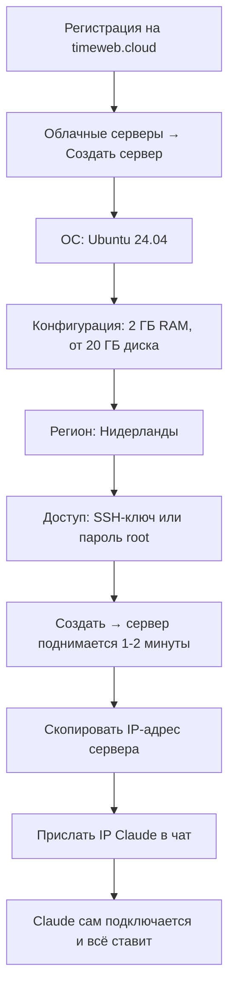

# Как создать сервер на Timeweb

Ты ничего не набираешь в терминале — пишешь Claude в чат, он делает сам. Руками ты
только кликаешь в личном кабинете Timeweb (создать сервер) и один раз открываешь ссылку
входа в браузере. Всё остальное — просьба к Claude в чат.

Сервер — это чужой компьютер в дата-центре, который работает круглосуточно. На нём
будет жить твоя панель с Claude, а команда будет заходить на неё через браузер. Здесь —
как этот сервер завести. Нажимать кнопки в личном кабинете Timeweb придётся тебе:
Claude не умеет кликать за тебя в чужом сайте. Но как только у сервера появится
IP-адрес, ты просто присылаешь этот IP Claude в чат — и дальше он сам подключается и
всё ставит (см. [INSTALL-AI.md](../INSTALL-AI.md)).

Весь путь — минут на 15.



---

## Шаг 1. Регистрация

Зайди на **[timeweb.cloud](https://timeweb.cloud/?i=144973)** и заведи аккаунт (почта +
пароль, подтверждение по письму). Пополни баланс — на первый месяц хватит 1500 ₽. Оплата
российской картой проходит.

> **Маленькая просьба.** Я сам держу на Timeweb сервер своей команды — тот самый, с которого
> собран этот комплект. Ссылка выше моя, реферальная. Буду благодарен, если зарегистрируешься
> по ней: цена для тебя обычная, по прайсу, а мне хостер начислит небольшой бонус. Инструкцию
> я написал бесплатно — если она помогла, это будет приятной поддержкой в ответ. А не
> хочется — открой timeweb.cloud напрямую, дальше всё одинаково.

---

## Шаг 2. Создать сервер

В личном кабинете: **«Облачные серверы»** → кнопка **«Создать сервер»**. Дальше
Timeweb покажет один длинный экран с настройками — идём по нему сверху вниз.

### Операционная система

Выбери **Ubuntu 24.04**. Это система, под которую написан весь комплект. Другие версии
или другие системы (Debian, CentOS) не подойдут — установщик рассчитан именно на неё.

### Конфигурация (мощность)

Тут выбираешь, сколько у сервера памяти и процессоров. От этого зависит и цена, и что
поместится.

| Вариант | RAM | CPU | Диск | Что помещается | Цена, Нидерланды |
|---|---|---|---|---|---|
| **Бери этот** | **2 ГБ** | 1-2 | от 20 ГБ | Панель с Claude на команду: чаты, файлы, память каждого | **1188-1602 ₽** |
| Только под дизайн | 4 ГБ | 2 | от 40 ГБ | То же плюс Claude Design — ему нужно ~1,5 ГБ в момент генерации | около 2000 ₽ |
| Мимо | 1 ГБ | 1 | 15 ГБ | 810 ₽ выглядят заманчиво, но чат валится по памяти | — |

**Не бери 1 ГБ.** Мы начинали ровно с такого и потом переехали: вкладка «Браузер» на
нём вообще не ставится (ей нужно от 1,8 ГБ), а чат падает, как только Claude берётся за
что-то тяжёлое. Экономия в 400 ₽ оборачивается вечером починок.

**2 ГБ хватает.** Это рабочий минимум для панели на небольшую команду. Разница между тарифом
за 1188 ₽ (1 ядро, 30 ГБ диска, канал 200 Мбит) и 1602 ₽ (2 ядра, 40 ГБ, гигабит) — в скорости
сборок и запасе места. Начинай с младшего: упрёшься — конфигурацию сервера поднимешь позже
в личном кабинете Timeweb, заново ставить ничего не придётся.

**4 ГБ — только если ставишь Claude Design.** Инструмент дизайна во время генерации съедает
до 1,5 ГБ, и на двушке он вытеснит панель. Нужен дизайн — бери сразу 4 ГБ, у меня команда
работает как раз на таком, выходит около 2000 ₽ в месяц.

**Про диск — его надо меньше, чем кажется.** Замерил на своём сервере: Ubuntu, Node, Claude
и вся история чатов команды весят около 11 ГБ. Файлы людей растут медленно — у меня на 27
человек это 66 МБ. Так что **20 ГБ хватает с запасом**, 15 ГБ — впритык (кэши со временем
надуваются), а вот 10 ГБ уже не влезут: одна система с Claude их съест. Отдельная история —
Claude Design: он тянет Docker и образы контейнера, а это ещё +8 ГБ, поэтому под дизайн бери
**от 40 ГБ**.

Цены — прайс Timeweb на июль 2026 для локации Нидерланды, они меняются. Итоговую сумму
смотри на самом экране создания сервера.

### Регион (где стоит сервер)

Выбери **европейский** регион — у Timeweb это Нидерланды (Амстердам), цены выше как раз по
нему; Германия тоже подойдёт. Это важно: Claude не
пускает к себе российские адреса, а с европейского сервера открывается спокойно, **без
VPN**. Если выбрать российский регион — Claude работать не будет. Российские дата-центры
Timeweb для этой задачи не годятся.

---

## Шаг 3. Как заходить на сервер — ключ или пароль

Чтобы управлять сервером, к нему подключаются по **SSH** (это защищённый способ зайти в
командную строку чужого компьютера). Подключаться будет **Claude, а не ты**. Но Timeweb
при создании сервера спросит, как подтверждать вход: **SSH-ключом** или **паролем root**.
Выбери что-то одно — а данные для входа отдашь Claude в чат.

### Вариант А. SSH-ключ (надёжнее, рекомендуем)

SSH-ключ — как цифровой ключ от двери: секретную половину (сам ключ) держат на твоём
компьютере, публичную половину (замок) кладут на сервер, и открыть дверь может только
этот ключ. Пароль подобрать можно, ключ — практически нет. У ключа две части:
**секретная** (остаётся у тебя на компьютере, её никому не показывают) и **публичная**
(её и вставляют в Timeweb — это безопасно). Ниже — как получить публичную часть и куда её вставить.

**Шаг 1 — создать ключ.** Напиши Claude в чат: **«Подготовь ключ доступа к серверу»**.
Claude проверит, есть ли у тебя ключ на компьютере, создаст его при необходимости и
пришлёт тебе **одну длинную строку** — она начинается на `ssh-ed25519 AAAA…`. Это и есть
публичная часть. Скопируй её целиком. Секретную половину Claude оставляет у тебя на
компьютере и никуда не отправляет.

> Под капотом Claude выполнит: `ssh-keygen -t ed25519 -N "" -f ~/.ssh/id_ed25519`, а
> потом покажет содержимое `~/.ssh/id_ed25519.pub` — ту самую строку, что ты вставишь
> в Timeweb.

> Если хочешь сделать сам, без Claude: на Mac открой программу «Терминал», на Windows —
> «PowerShell», и набери `ssh-keygen -t ed25519` (на все вопросы жми Enter — путь и без
> пароля подойдут). Публичная строка окажется в файле `~/.ssh/id_ed25519.pub` — открой
> его и скопируй единственную строку оттуда.

**Шаг 2 — привязать ключ к Timeweb.** На экране создания сервера найди блок **«SSH-ключ»**
(в разделе про доступ к серверу) и сделай так:

1. Нажми **«Добавить»** (или «Новый SSH-ключ» / «Добавить ключ» — формулировка у Timeweb
   меняется).
2. Откроется окошко с двумя полями. В поле **имя** впиши что угодно, например `my-key`.
   В большое поле **«Ключ»** вставь ту самую строку `ssh-ed25519 AAAA…`, что дал Claude.
3. Нажми **«Добавить» / «Сохранить»**. Ключ появится в списке.
4. **Поставь галочку** напротив этого ключа — так он привяжется к создаваемому серверу.
   Если галочки нет, сервер поднимется без ключа, и войти не получится.

Можно и заранее: в личном кабинете Timeweb есть раздел **«SSH-ключи»** (в настройках
профиля/аккаунта) — добавь ключ там один раз, и потом просто выбирай его галочкой при
создании любого сервера.

Проверять руками, что ключ «сработал», не нужно — это сделает Claude, когда ты пришлёшь
ему IP (Шаг 5): он сам попробует зайти на сервер и скажет, получилось или нет.

### Вариант Б. Пароль root

Если возиться с ключом не хочется — выбери вход по паролю. Timeweb сгенерирует **пароль
пользователя root** (главный пользователь сервера) и покажет его один раз. **Запиши его
сразу** — потом не восстановить, только сбрасывать. Этот пароль ты пришлёшь Claude в
чат — он один раз войдёт на сервер с ним, поставит свой ключ и больше пароль спрашивать
не будет.

Ключ безопаснее и удобнее, но пароль проще для старта. Оба варианта рабочие.

---

## Шаг 4. Создать и узнать IP-адрес

Нажми **«Создать сервер»**. Сервер поднимается 1-2 минуты. Когда он появится в списке и
загорится «Активен», у него будет **IP-адрес** — четыре числа через точку, например
`203.0.113.45`. Он написан на карточке сервера. Скопируй его — это единственное, что
нужно передать Claude, чтобы он начал установку.

---

## Шаг 5. Отдать сервер Claude

Дальше ты не подключаешься к серверу сам — это делает Claude. Просто пришли ему IP в чат.

Напиши Claude в чат: **«Вот IP сервера: 203.0.113.45. Подключись и продолжай установку
по INSTALL-AI.md»** (подставь свой IP вместо `203.0.113.45`). Если выбирал вход по
паролю — добавь пароль root в это же сообщение. Дальше Claude сам зайдёт на сервер по
SSH, проверит, что это Ubuntu 24.04, и продолжит установку. Он напишет тебе, что уже на
сервере, и что делает.

> Под капотом Claude выполнит: `ssh -o StrictHostKeyChecking=accept-new root@<IP> 'echo
> SSH_OK; lsb_release -d'` — это проверка, что вход работает и система подходящая.

> **Про частые подключения.** Timeweb защищается от перебора паролей и **режет частые
> SSH-подключения подряд**. Если Claude словит ошибку `Connection reset by peer` на порту
> 22 — он подождёт 30 секунд и попробует снова. Это временная защита, не поломка, и от
> тебя тут ничего не требуется.

---

## Шаг 6. Что дальше

Сервер готов — дальше на него ставится сама панель, и это тоже делает Claude, не ты.
Открой эту папку-комплект как проект в Claude Code (или Codex) и напиши: **«Разверни по
INSTALL-AI.md»**. Claude сам зайдёт на сервер, всё установит и попросит тебя только об
одном — один раз открыть ссылку входа в браузере (с VPN) и прислать код обратно в чат.
Разбор шагов установки — в [INSTALL-AI.md](../INSTALL-AI.md), это инструкция для самого
Claude.

Про вход в Claude и ChatGPT — [03-login.md](./03-login.md). Общая картина, как всё
устроено, — в [README.md](../README.md).

---

## Какой у команды будет адрес

После установки панель откроется по адресу, собранному **из IP сервера**: точки в адресе
заменяются на дефисы, и добавляется `.sslip.io`. Пример:

```
IP сервера:      203.0.113.45
Адрес панели:    https://203-0-113-45.sslip.io
```

Это бесплатно, домен покупать не нужно, шифрование (HTTPS, замочек в браузере) включается
само. Claude пришлёт готовый адрес в конце установки.

**Важная тонкость: адрес привязан к IP.** Если IP сервера сменится (например, ты пересоздашь
сервер или переедешь на другой) — сменится и адрес, и старую ссылку придётся раздать команде
заново. Чтобы адрес был **постоянным** и не зависел от IP, нужен свой домен (покупается
отдельно, стоит примерно 200-1000 ₽ в год) и настройка его на этот сервер. Для старта хватает
бесплатного `sslip.io`-адреса; домен можно подключить позже.

---

Если что-то пошло не так на этом этапе (сервер не поднялся, Claude не может подключиться) —
напиши ему «панель не ставится, разберись» или загляни в
[06-troubleshooting.md](./06-troubleshooting.md).
