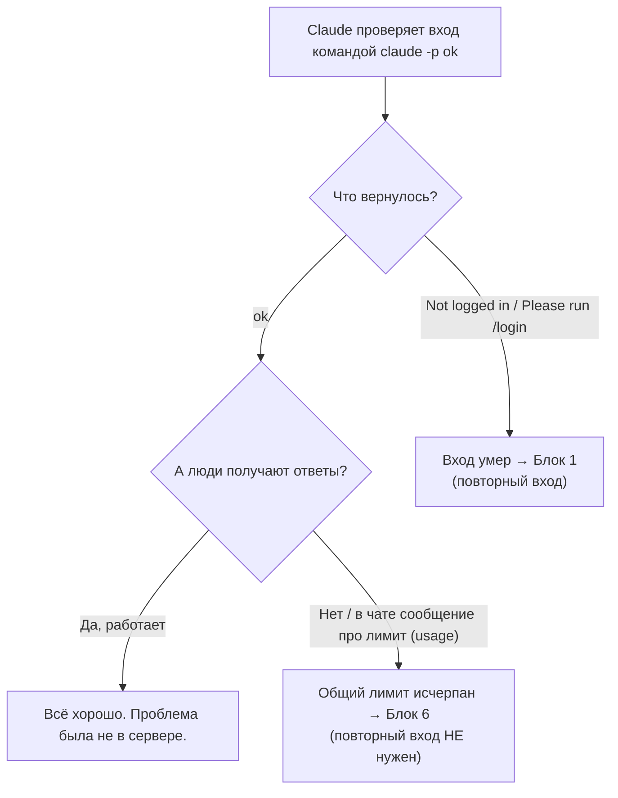

# Что делать, если сломалось

Ты ничего не набираешь в терминале — пишешь Claude в чат простыми словами, что случилось, а он сам заходит на сервер, разбирается и чинит.

Ниже — разбор по схеме **симптом → что написать Claude → что он сделает и пришлёт в ответ**. Найди свой случай и просто опиши проблему в чат так, как она выглядит у тебя.

Твои руки нужны только в двух местах на всём сервере: клики в панели Timeweb при создании сервера и открытие ссылки для входа в браузере с VPN (скопировать код и вставить его обратно в чат). Всё остальное делает Claude.

Устройство сервера простыми словами — в [01-how-it-works.md](./01-how-it-works.md). Обновления, бэкапы, лимиты — в [07-maintenance.md](./07-maintenance.md).

> Технические команды ниже показаны в блоках «Под капотом» — только чтобы любопытный читатель видел, что именно делает Claude. Тебе их набирать не нужно.

---

## Блок 0. Первая проверка при ЛЮБОЙ жалобе на Claude

Если кто-то говорит «Claude не отвечает» — не гадай сам и не проси гадать Claude. Просто напиши:

**Напиши Claude в чат:** «Люди жалуются, что Claude не отвечает. Проверь, живой ли вход на сервере». Claude сам сделает одну короткую проверку (она годится и для панели, и для Claude Design) и по ответу скажет тебе, в чём дело: вход живой и надо смотреть в другую сторону, вход умер и нужен повторный вход, или исчерпан общий лимит подписки.

> Под капотом Claude выполнит: `IS_SANDBOX=1 HOME=/root /usr/bin/claude -p "ok"` и посмотрит на ответ.

Логика, по которой Claude ставит диагноз (тебе её знать не обязательно, но пусть будет видно):

- Проверка вернула **`ok`** — вход живой, движок работает. Если при этом люди всё равно не получают ответы или видят в чате сообщение про лимит (usage) — это НЕ поломка входа, а **общий лимит подписки** (см. блок 6). Повторный вход тут не поможет, и Claude тебе так и скажет.
- Проверка вернула **`Not logged in`** или **`Please run /login`** — вход умер. Claude сам предложит сделать повторный вход, см. **блок 1**.

**Claude сообщит тебе:** живой вход или нет, и что делать дальше — без твоего участия в терминале.

---

## Блок 1. «Claude login has expired» / чат в панели молчит / в настройках «Не подключён»

**Причина.** Умер общий вход по подписке Claude (файл `/root/.claude/.credentials.json`). Обычно вход обновляется сам, но иногда «протухает» насовсем — тогда его надо оживить. Важно: если просто запустить Claude, он может обманчиво написать «Welcome back» из старого кэша, а реальный запрос всё равно упадёт. Поэтому Claude верит только проверке из блока 0, а не приветствию.

**Что написать Claude:** «Вход Claude на сервере умер, сделай повторный вход». Тут понадобишься ты на 1 минуту — с включённым VPN.

Как это пройдёт по шагам:

1. Claude запустит вход на сервере и пришлёт тебе ссылку `https://…`.
2. **Открой эту ссылку в браузере с включённым VPN**, войди в СВОЙ аккаунт Claude (тот, где подписка). Сайт покажет **код**.
3. Скопируй код и **вставь его в чат** Claude. Пароль вводишь только на сайте Claude — Claude его не спрашивает.
4. Claude вставит код, проверит вход и скажет, получилось или нет.

> Под капотом Claude выполнит: сначала `bash login-claude.sh` (покажет ссылку), потом `bash login-claude.sh '<КОД>'` (впишет твой код). Скрипты лежат на сервере в `/root/claudecode-kit-src`.

**Claude сообщит тебе:** `LOGIN OK`, вход снова живой (он перепроверит его проверкой из блока 0).

**Если после входа перестал работать Claude Design** — напиши об этом Claude, см. блок 2 (иногда вход подтягивает свежую версию движка и рвёт контейнер). Копию входа для Claude Design Claude освежает сам, отдельно ничего копировать не нужно.

Подробнее про вход — [03-login.md](./03-login.md).

---

## Блок 2. Claude Design не работает / в контейнере «claude: not found»

**Причина.** Движок `claude` на сервере обновился, а Claude Design держит на него ссылку по старому «адресу файла» — после обновления ссылка мертва, и внутри контейнера claude «исчезает». Обычно случается сразу после повторного входа (блок 1).

**Что написать Claude:** «Claude Design не открывается / внутри пишет claude: not found — пересоздай контейнер». Claude сам пересоберёт контейнер Claude Design и проверит, что движок внутри снова отвечает.

> Под капотом Claude выполнит: `cd /opt/open-design/deploy && HOME=/root docker compose -f docker-compose.yml -f docker-compose.linux.yml up -d --force-recreate`, затем проверку `docker exec … open-design /mnt/host-claude-bin/claude -p "ok"`.

**Claude сообщит тебе:** внутренняя проверка вернула `ok`, и кнопка «Claude Design» в панели снова открывает рабочий экран.

Подробнее про Claude Design — [05-open-design.md](./05-open-design.md).

---

## Блок 3. Пользователь видит старую версию панели / правка внешнего вида «не появилась»

**Причина.** Браузер кэширует (запоминает) файлы панели надолго, плюс есть служба, которая держит старую версию. Свежая сборка до человека сразу не долетает.

**Что делать.** Тут ни сервер, ни Claude не нужны — дело в браузере у человека. Попроси человека **обновить страницу с очисткой**: нажать **F5** (на Mac — `Cmd+R`), а лучше жёстко — `Ctrl+F5` (на Mac `Cmd+Shift+R`). Служба подтянет новую версию.

Если и после этого висит старая версия — тогда **напиши Claude:** «После жёсткого обновления страницы у человека всё равно старая панель, проверь сервер». Claude посмотрит, что новая сборка реально выложена.

**Что должно быть видно:** после обновления страницы человек видит актуальный вид (тема, кнопки, вкладки).

---

## Блок 4. Пользователь видит ЧУЖИЕ проекты и чаты в списке слева

Это серьёзно — сломалась изоляция (разделение людей по своим папкам).

**Причина.** Слетели наши доработки изоляции. Почти всегда это происходит после обновления панели командой `cloudcli update` — обновление сносит все наши правки начисто.

**Что написать Claude:** «Люди видят чужие проекты и чаты в панели — переустанови наши доработки изоляции». Claude заново накатит все правки (это идемпотентная установка, её безопасно запускать повторно), а потом попросит тебя, чтобы все, кто был залогинен, **один раз обновили страницу (F5)** — так сбрасываются чужие записи, осевшие в старой сессии.

> Под капотом Claude выполнит: `cd /root/claudecode-kit-src && bash install.sh` и дождётся строки `BASE INSTALL DONE`.

**Claude сообщит тебе:** установка дошла до `BASE INSTALL DONE`, и каждый после F5 видит только свои проекты и чаты.

> Важно: изоляция работает на уровне панели. Технически подкованный человек через терминал всё же сможет прочитать чужое — для доверенной команды это нормально, для чужих людей — нет. Подробности честных ограничений — в [01-how-it-works.md](./01-how-it-works.md).

---

## Блок 5. После `cloudcli update` слетело ВСЁ (тема, вкладки, изоляция, вложения)

**Причина.** Кнопка/команда обновления переустанавливает панель начисто и стирает все наши правки разом. Именно поэтому кнопку «Обновить» из интерфейса убрали — один клик стирал изоляцию у всех.

**Что написать Claude:** «После обновления панели слетело всё — тема, вкладки, изоляция, вложения. Переустанови наши доработки одной командой». Claude заново накатит все правки (установка идемпотентная — её безопасно запускать сколько угодно раз) и пришлёт адрес панели. После этого попроси команду обновить страницу (F5).

> Под капотом Claude выполнит: `cd /root/claudecode-kit-src && bash install.sh`.

**Claude сообщит тебе:** в конце — `BASE INSTALL DONE` и адрес панели.

Про обновления и что при них слетает — [07-maintenance.md](./07-maintenance.md).

---

## Блок 6. Люди упёрлись в лимит (в блоке 0 вернулось `ok`, но ответов нет)

**Причина.** Одна подписка — один общий лимит на всех. Если команда его исчерпала, Claude временно перестаёт отвечать или показывает сообщение про usage/лимит. Это НЕ поломка входа.

**Что делать.** Если Claude в блоке 0 подтвердил, что вход живой (`ok`), а ответов всё равно нет — значит исчерпан общий лимит. Тут делать нечего: нужно **подождать сброса окна лимита**, обычно несколько часов. Повторный вход (блок 1) не нужен и не поможет — и если сомневаешься, просто **напиши Claude:** «Проверь, это лимит или поломка входа», он перепроверит и подтвердит.

**Что должно быть видно после сброса:** проверка из блока 0 по-прежнему `ok`, и чат снова отвечает.

> Честно: много людей на одной подписке — против правил Anthropic (риск блокировки аккаунта). Это удобно для маленькой доверенной команды, а не сервис на каждого со своим лимитом. Подробнее — [07-maintenance.md](./07-maintenance.md).

---

## Блок 7. Claude сообщает «Connection reset by peer» / не может достучаться до сервера

**Причина.** Хостер режет частые подключения подряд (защита от перебора паролей). Не поломка сервера. Обычно всплывает, когда Claude делает много действий на сервере залпом.

**Что делать.** Ничего сложного. Если Claude написал, что не смог подключиться («Connection reset by peer» на порту 22), просто **напиши Claude:** «Подожди секунд 30 и попробуй ещё раз». Claude сам разнесёт команды по времени и переподключится. Своих рук тут не нужно вовсе.

**Что должно быть видно:** Claude снова на связи с сервером и продолжает работу.

---

## Блок 8. Адрес не открывается / HTTPS-сертификат не выдаётся

**Причина.** Бесплатный адрес (`sslip.io`) и бесплатный сертификат (Let's Encrypt) иногда упираются в общий лимит выпуска сертификатов. Плюс при смене IP-адреса меняется и адрес сайта.

**Что делать по порядку.**

1. Сначала просто подожди 1–2 минуты и обнови страницу — на первом открытии сертификат берётся ~20 секунд. Это дело браузера, не сервера.
2. Если не помогло — **напиши Claude:** «Адрес панели не открывается / браузер ругается на сертификат — проверь порты и швейцара HTTPS». Claude проверит, что открыты порты 80 и 443 (файрвол) и что «швейцар» Caddy (он раздаёт HTTPS) жив, и посмотрит его логи.

> Под капотом Claude выполнит: `ufw status` (ждёт строки `80/tcp ALLOW`, `443/tcp ALLOW`, `22/tcp`), затем `systemctl status caddy` и `journalctl -u caddy -n 50 --no-pager` (ждёт `active (running)` без повторяющихся ошибок про сертификат).

**Claude сообщит тебе:** живы ли порты и Caddy, и не упёрся ли выпуск сертификата в лимит.

Если лимит сертификатов действительно исчерпан — Claude предложит подождать несколько часов и повторить либо завести постоянный адрес (свой домен или DuckDNS). Подробнее — [07-maintenance.md](./07-maintenance.md).

---

## Блок 9. Кончается память или диск / панель тормозит

**Что считать нормой.** На сервере с 4 ГБ оперативной памяти в простое занято около 1 ГБ. Claude Design во время генерации может съесть до ~1 ГБ (стоит ограничитель 1536 МБ — если упрётся, система убьёт только контейнер Claude Design, панель не тронет).

**Что написать Claude:** «Панель тормозит, проверь память и диск на сервере». Claude посмотрит память, диск и контейнеры и скажет, тесно ли.

> Под капотом Claude выполнит: `free -h; df -h /; docker stats --no-stream`. Норма: в `free -h` есть свободная память (столбец `available`); в `df -h /` использовано меньше ~90% (столбец `Use%`).

Если тесно — **напиши Claude:** «Почисти лишнее, чтобы освободить место». Claude знает, что можно удалить без вреда:

| Что удалить | Что делает Claude под капотом | Освободит |
|---|---|---|
| Промежуточный образ Claude Design (нужен только для сборки) | `docker image rm open-design-base:latest` | ~740 МБ |
| Старые системные логи | `journalctl --vacuum-size=200M` | зависит от объёма |

**Claude сообщит тебе:** после чистки `df -h /` показывает больше свободного места.

---

## Блок 10. Панель не открывается, а вход и сертификат живы

Если блок 0 вернул `ok` и адрес по HTTPS отвечает, но сама панель не грузится — **напиши Claude:** «Панель не открывается, хотя вход и адрес живы — перезапусти её и посмотри логи». Claude перезапустит службу панели и разберёт логи.

> Под капотом Claude выполнит: `systemctl status cloudcli`, `journalctl -u cloudcli -n 50 --no-pager`, `systemctl restart cloudcli`. Норма после перезапуска — `active (running)`, панель открывается.

Если в логах повторяется ошибка про `already been declared` — значит доработки применились криво (обычно после ручной возни с патчами). Самое простое лечение — переустановить всё заново (как в блоке 5). Просто **напиши Claude:** «В логах панели ошибка already been declared — переустанови доработки заново», и он накатит `install.sh`.

**Claude сообщит тебе:** после перезапуска панель показывает `active (running)` и снова открывается.

---

## Профилактика, которая работает сама (ничего делать не надо)

| Механизм | Что делает |
|---|---|
| `claude-keepalive.timer` (каждые 3 часа) | тихо гоняет `claude -p ok` — освежает вход, он не «протухает» в простое |
| `od-creds-sync.path` + `od-creds-sync.timer` (сразу + каждые 15 минут) | копирует вход в отдельную копию для Claude Design |
| `DISABLE_AUTOUPDATER=1` | движок Claude не обновляется сам и не роняет Claude Design |

Хочешь убедиться, что всё это живо — **напиши Claude:** «Проверь, что таймеры профилактики на сервере работают».

> Под капотом Claude выполнит: `systemctl is-active claude-keepalive.timer od-creds-sync.path od-creds-sync.timer` (ждёт три строки `active`).

**Claude сообщит тебе:** все три таймера `active`. Если какой-то `inactive` — Claude сам перезапустит установку (как в блоке 5), она поднимет таймеры заново.
